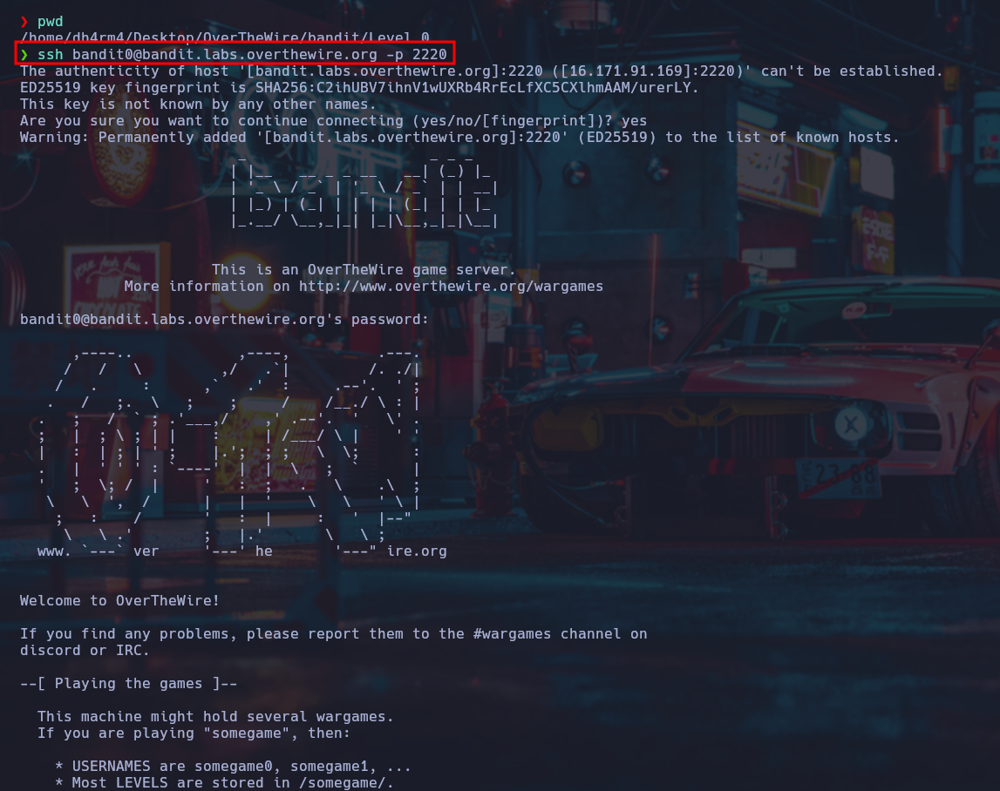

# Introducción

**OverTheWire** es una plataforma en línea gratuita diseñada para que aprendas y
pongas a prueba tus habilidades en seguridad cibernética a través de juegos
interactivos. Cada uno de estos juegos aborda aspectos fundamentales de la 
seguridad informática, y la mejor forma de comenzar es con su juego más básico, Bandit.

Este juego es ideal para quienes están dando sus primeros pasos en el mundo 
de la seguridad, ya que enseña desde los comandos básicos de **Linux** hasta conceptos de **Git**, los cuales son esenciales para progresar en otros desafíos más avanzados.
 
Aunque ya existen varias guías sobre Bandit disponibles en la web, decidí escribir la mía propia. Esto no solo me permite practicar la escritura, sino que también me da la oportunidad de ofrecer mi perspectiva personal sobre las soluciones y explicar los pasos de una forma que tal vez sea más comprensible para algunos. Además, tener esta guía en mi blog servirá como referencia futura para mí y, quizás, para alguien más que se enfrente a los mismos problemas.

Mi objetivo será explicar los conceptos clave de forma breve pero clara, aunque siempre existe más por aprender. Te animo a investigar más a fondo cada tema por tu cuenta, ya que el aprendizaje continuo es clave en este campo.

Ahora que sabes el propósito de este artículo, ¡comencemos con la guía para el **Nivel 0**!

# Objetivo

 La misión de este nivel es conectarte a un servidor a través de **SSH**

 Servidor: **bandit.labs.overthewire.org**
 
 Puerto: **2220**

Usuario: **bandit0**

Contraseña: **bandit0**

# Teoría
 
 En este nivel, el reto consiste en usar **SSH** (Secure Shell Protocol), un protocolo de comunicación que permite la conexión remota segura entre computadoras. Es fundamental en la administración de servidores y en la interacción con máquinas a través de la terminal.

Si usas **Linux**, puedes conectarte a una máquina remota mediante **SSH** desde la terminal usando el comando ssh. Para obtener más detalles sobre cómo utilizarlo, puedes consultar la página de manual con el comando man ssh. En **Windows**, se recomienda usar herramientas como **PuTTY** para establecer conexiones **SSH**

El puerto estándar de **SSH** es el **22**, aunque en este caso, deberás utilizar el puerto **2220** para conectarte al servidor de **OverTheWire**. Si estás familiarizado con el concepto de puertos, puedes imaginarlo como un número de habitación al que debes dirigirte dentro de un edificio, asegurando que el mensaje llegue al destino correcto.

Si no estás familiarizado con estos términos, te sugiero que investigues más sobre redes y protocolos de comunicación, ya que son conceptos fundamentales que te serán útiles a lo largo de todo el juego y más allá.

# Solución

Para conectarte al servidor, abre una terminal en **Linux **(o usa tu herramienta SSH en Windows) y usa la siguiente estructura de comando:

 
 ```
 ssh <nombreusuario>@<servidor> -p <puerto>
 ```
  
Asegúrate de reemplazar **nombreusuario**, **servidor** y **puerto** con los valores correctos, como se indica en la tarea. En este caso, el comando será:

```
ssh bandit0@bandit.labs.overthewire.org -p 2220
```

Al ejecutar el comando, se te pedirá que ingreses la contraseña. Es importante destacar que, en la mayoría de las terminales, la contraseña no se mostrará al escribirla, pero aún así estará siendo registrada.

Contraseña para bandit0: **```bandit0```**

Si todo se hizo correctamente, verás un mensaje de bienvenida que te indicará que has iniciado sesión en el servidor y te proporcionará más información sobre el juego.

Con esto, habrás completado con éxito el **Nivel 0**


