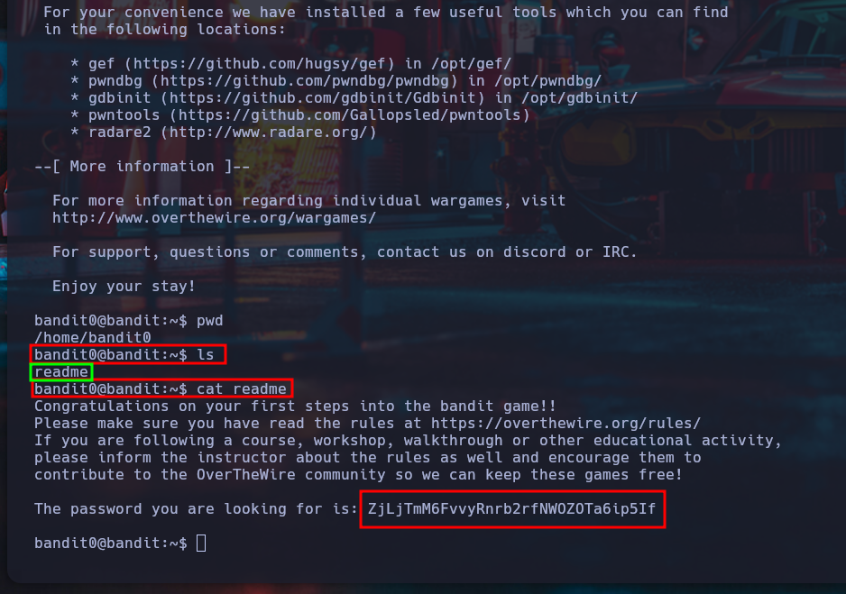

# Nivel 1 - Bandit - OverTheWire

## Introducción

OverTheWire es una plataforma online donde puedes aprender y practicar conceptos de seguridad informática a través de juegos de guerra (wargames).
El primero que se recomienda jugar es Bandit, ya que introduce los fundamentos básicos para manejarte en un entorno Linux y resolver desafíos de niveles superiores.

Esta guía forma parte de mi repositorio de soluciones, con explicaciones claras para quien quiera aprender o necesite una referencia rápida.

## Objetivo

Acceder por SSH al servidor de Bandit usando las credenciales proporcionadas y obtener la contraseña del siguiente nivel, almacenada en un archivo llamado readme en el directorio home.

## Teoría

Cuando inicias sesión en un servidor remoto mediante SSH como un usuario específico, comienzas en el directorio home de ese usuario.

Algunos comandos básicos que vamos a utilizar:

**pwd**: muestra el directorio actual.

**ls**: lista los archivos y carpetas en el directorio actual. Opciones útiles:

**-l**: muestra la información en formato de lista detallada.

**-a**: incluye archivos ocultos.

**cat**: muestra el contenido de un archivo en la terminal.

*Recordatorio: el comando **man** te permite consultar documentación de cualquier comando (man ls, man cat, etc.)*

SSH normalmente utiliza el puerto 22, pero en este caso específico debemos conectarnos a un puerto diferente: el 2220.

## Solución

Conectarnos al servidor mediante SSH:

```
ssh bandit0@bandit.labs.overthewire.org -p 2220
```

Usuario: **bandit0**
Contraseña: **bandit0**

Verificamos que estamos en el directorio home:

```
pwd
```

El resultado debería ser:

```
/home/bandit0
```

Listamos los archivos disponibles:

```
ls
```

Deberíamos ver el archivo readme:

```
readme
```

Mostramos el contenido del archivo:

```
cat readme
```

Resultado esperado:

```
ZjLjTmM6FvvyRnrb2rfNWOZOTa6ip5If
```

Este es el password para conectarnos como el usuario bandit1 en el siguiente nivel.


