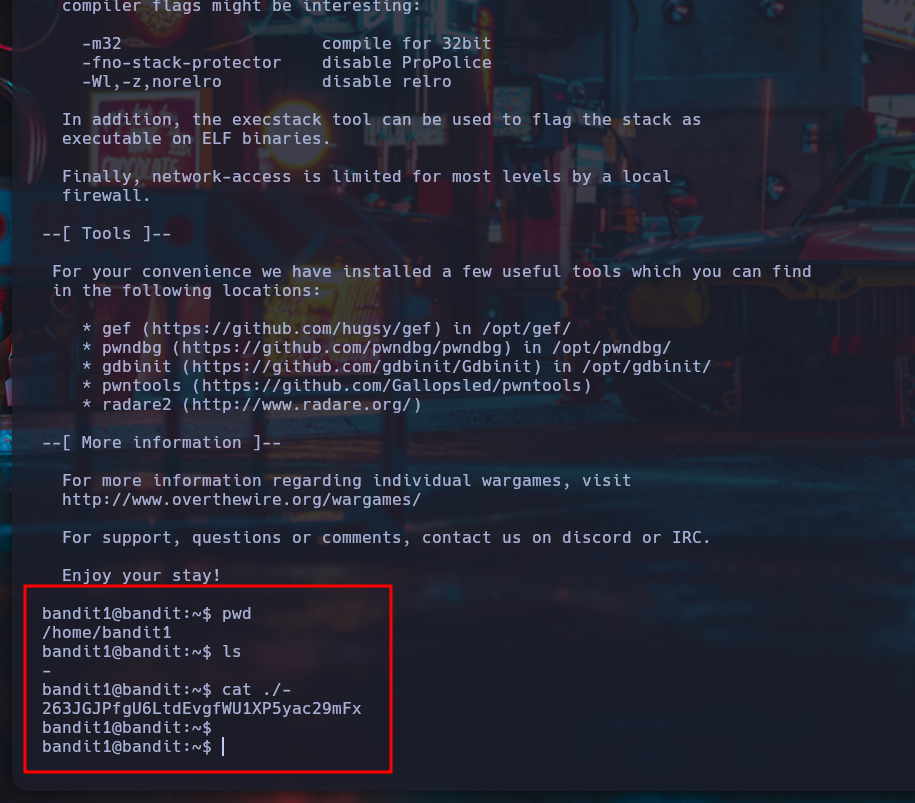

#Nivel 1 - Bandit - OverTheWire

##Introducción

Continuamos avanzando en el wargame Bandit de OverTheWire, donde se ponen a prueba habilidades básicas de navegación y manipulación de archivos en Linux.
Este nivel es una excelente oportunidad para seguir familiarizándonos con los comandos esenciales del sistema operativo.

##Objetivo

Encontrar la contraseña para el usuario bandit2, la cual está almacenada en un archivo llamado - ubicado en el directorio home.

##Teoría

En este desafío trabajaremos con un archivo que tiene un nombre algo particular: un solo guion -.
Esto puede ser confuso, porque en Linux el - suele representar la entrada o salida estándar (stdin/stdout) o utilizarse como prefijo para opciones de comando.

Para manejar archivos con nombres "problemáticos" en Linux, podemos:

Especificar la ruta del archivo de manera explícita (por ejemplo, ./-).

Usar técnicas para evitar que el intérprete confunda el nombre del archivo con una opción del comando.

Algunos comandos útiles:

**ls**: lista los archivos en el directorio actual.

**cat ./-**: imprime el contenido del archivo cuyo nombre es -. El ./ indica que el archivo está en el directorio actual.

##Solución paso a paso

Iniciar sesión con SSH utilizando las credenciales del nivel 1:

```
ssh bandit1@bandit.labs.overthewire.org -p 2220
```

Usuario: **bandit1**
Contraseña: (contraseña obtenida en el nivel anterior)

Verificar que estamos en el directorio home:

```
pwd
```

Debería mostrar:

```
/home/bandit1
```

Listar los archivos en el directorio:

```
ls
```

Salida esperada:

```
-
```

Leer el contenido del archivo llamado -:

Debido al nombre especial, debemos usar ./ para indicar que es un archivo en el directorio actual:

```
cat ./-
```

Esto imprimirá en pantalla la contraseña para el siguiente nivel:

```
263JGJPfgU6LtdEvgfWU1XP5yac29mFx
```

Ahora puedes usar esta contraseña para conectarte como bandit2 en el siguiente nivel.


