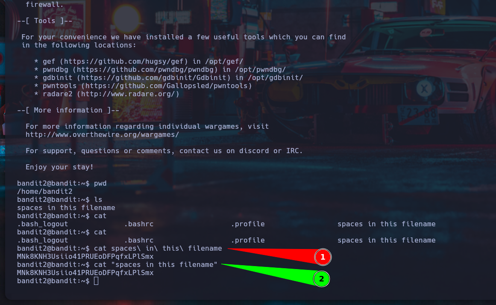

# Nivel 2 -> 3 - Bandit - OverTheWire

## 📖Introducción

En este nivel de Bandit, nos enfrentamos a un pequeño desafío relacionado con el manejo de archivos cuyos nombres contienen espacios.
Aprenderemos cómo acceder correctamente a ellos usando la terminal.

## 🎯Objetivo

Encontrar la contraseña para el usuario bandit3, almacenada en un archivo llamado:

```
spaces in this filename
```

ubicado en el directorio home.

## 📚Teoría

En sistemas Linux, los espacios en los nombres de archivos o carpetas pueden causar problemas al ejecutar comandos.
El intérprete de comandos separa los argumentos por espacios, por lo que un nombre de archivo que incluye espacios debe ser tratado de forma especial.

Formas de manejar archivos con espacios en sus nombres:

- Colocar el nombre entre comillas (```" "```) para que sea interpretado como un solo argumento.

- Usar el caracter de escape *\* antes de cada espacio (```\ ```).

Ejemplos:

```
cat "spaces in this filename"
```

o

```
cat spaces\ in\ this\ filename
```

Ambos métodos son válidos para referirse correctamente al archivo.

## ✅Solución

1. Conectarse al servidor mediante SSH:

```
ssh bandit2@bandit.labs.overthewire.org -p 2220
```
Usuario: *bandit2*
Contraseña: (contraseña obtenida en el nivel anterior)

2. Verificar el directorio actual:

```
pwd
```

Deberías estar en:

```
/home/bandit2
```

3. Listar los archivos presentes:

```
ls
```

Salida esperada:

```
spaces in this filename
```

4. Leer el contenido del archivo:

Usando comillas:

```
cat "spaces in this filename"
```

o escapando los espacios:

```
cat spaces\ in\ this\ filename
```

Esto mostrará en pantalla la contraseña para el siguiente nivel:

```
MNk8KNH3Usiio41PRUEoDFPqfxLPlSmx
```

¡Listo! Ya tienes la contraseña para el usuario bandit3.


## Mini tabla de comandos

| Comando | Descripción |
|----------|----------|
| ```ls```    | Lista los archivos y carpetas del directorio actual |
| ```pwd``` | Muestra el directorio de trabajo actual   |
| ```cat "<nombre con espacios>"``` | Muestra el contenido de un archivo con espacios en el nombre   |
| ```cat nombre\ con\ espacios``` | Alternativa usando caracter de escape para espacios   |
| ```ssh``` | Permite iniciar sesión remota en otra máquina  |


