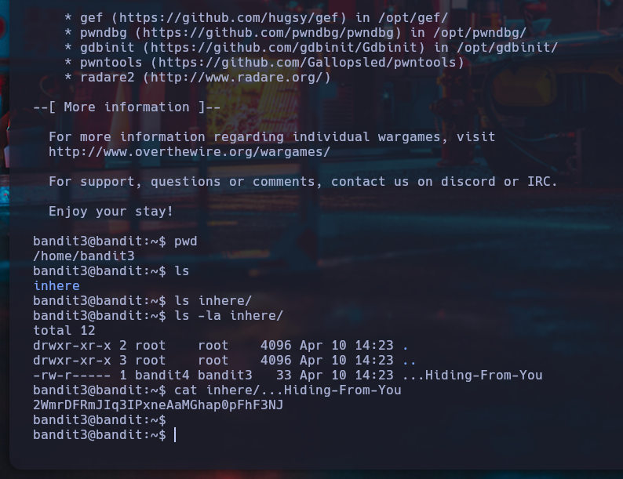

# Nivel 3 -> 4 - Bandit - OverTheWire

## Introducción

En este nivel, nos enfrentamos a un archivo escondido dentro de un directorio.
Aprenderemos a explorar directorios y a visualizar archivos que, aunque no sean evidentes, contienen información importante.

## Objetivo
Encontrar la contraseña para el usuario bandit4, ubicada en un archivo oculto dentro de una carpeta llamada inhere.

## Teoría
En Linux, los archivos o carpetas que comienzan con un punto (.) son considerados ocultos.
Estos archivos no aparecen cuando usamos el comando ls de manera normal. Para verlos, es necesario utilizar el flag -a que significa "mostrar todos los archivos".

 Comandos relevantes:

* ls: Lista el contenido de un directorio.

* ls -a: Lista todos los archivos, incluyendo los ocultos.

* ls -la: Lista todos los archivos en formato largo (permisos, dueño, tamaño, fecha).

* cat: Permite leer y mostrar el contenido de un archivo.

* La ruta hacia el archivo oculto puede requerir especificar el nombre completo incluyendo el ... inicial (porque el archivo tiene un nombre poco común).

## Solución

1. Conectarse al servidor mediante SSH:

```
ssh bandit3@bandit.labs.overthewire.org -p 2220
```
Usuario: ```bandit3```
Contraseña: (contraseña obtenida en el nivel anterior)

2. Verificar el directorio actual:

```
pwd
```

Salida esperada:

```
/home/bandit3
```

3. Listar los archivos:

```
ls
```

Aquí encontramos el directorio ```inhere```

4. Ingresar al directorio:

```
ls inhere/
```
No se ve nada. Entonces, listamos **incluyendo archivos ocultos**:

```
ls -la inhere/
```

Salida esperada:

```
drwxr-xr-x 2 root root 4096 Apr 10 14:23 .
drwxr-xr-x 3 root root 4096 Apr 10 14:23 ..
-rw-r----- 1 bandit4 bandit3  33 Apr 10 14:23 ...Hiding-From-You
```

5. Leer el archivo oculto:

```
cat inhere/...Hiding-From-You
```

**Resultado:**

```
2EW7BBsr6aMMoJ2HjW067dm8EgX26xNE
```

¡Y esa es la contraseña para el usuario **bandit4!**

## Mini tabla de comandos

| Comando | Descripción |
|----------|----------|
| ```ls```    | Lista los archivos y carpetas visibles del directorio actual |
| ```ls -a``` | Lista todos los archivos, incluyendo ocultos   |
| ```ls -la``` | Lista en formato extendido (permisos, dueño, etc)   |
| ```cat``` | Muestra el contenido de un archivo   |
| ```ssh``` | Conexion remota a traves de SSH   |


