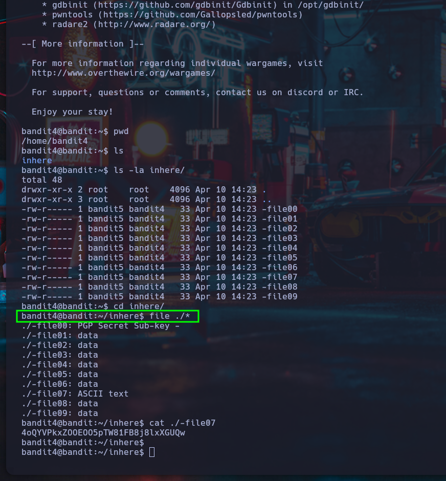

# Nivel 4 ➔ Nivel 5 - Bandit - OverTheWire

## 📖Introduccion

En este nivel se nos presenta un directorio con varios archivos. El desafío consiste en encontrar cuál contiene la contraseña del siguiente nivel.
A diferencia de niveles anteriores, no hay una pista evidente: debemos inspeccionar el contenido de los archivos para descubrir cuál es el correcto.

## 🎯Objetivo
Encontrar la contraseña para el usuario bandit6, ubicada en uno de los archivos dentro del directorio inhere.

## 📚Teoría
Para saber qué tipo de datos contiene un archivo en Linux, usamos el comando file, que analiza el contenido del archivo y no solo su extensión.
Una vez que sepamos cuál contiene texto legible, podremos usar cat para mostrar su contenido.

Comandos útiles:

file: Muestra el tipo de contenido que tiene un archivo.

cat: Muestra el contenido de un archivo.

cd: Navega entre carpetas.

ls -la: Lista todos los archivos, incluidos ocultos y detalles (tamaño, permisos, fecha, etc.).

## ✅Solucion

1. Conectarse al servidor mediante SSH:

```
ssh bandit5@bandit.labs.overthewire.org -p 2220
```

Usuario: ```bandit5```
Contraseña: (la obtenida del nivel anterior)

2. Ir al directorio inhere:

```
cd inhere
```

3. Ver todos los archivos en el directorio:

```
ls -la
```

Encontraremos 10 archivos: -file00, -file01, ..., -file09.

4. Revisar el tipo de archivo usando el comando file:

```
file ./*
```

Salida:

```
./-file00: PGP Secret Sub-key
./-file01: data
./-file02: data
./-file03: data
./-file04: data
./-file05: data
./-file06: data
./-file07: ASCII text
./-file08: data
./-file09: data
```

El único archivo con ASCII text (texto legible) es -file07, lo cual indica que probablemente contiene la contraseña.

5. Mostrar el contenido del archivo:

```
cat ./-file07
```

Salida:

```
4oUYVpkxZ0OE005pTW81FBj8lXxGUQw
```

Y esa es la contraseña para el usuario bandit5!

## Mini tabla de comandos

| Comando | Descripción |
|----------|----------|
| ```file ./archivo``` | Muestra el tipo de contenido del archivo |
| ```cat ./archivo``` | Muestra el contenido de un archivo |
| ```ls -la``` | Lista archivos ocultos y sus detalles |
| ```cd nombre_directorio``` | Cambia al directorio especificado |
| ```ssh``` | Conexion remota mediante SSH |


