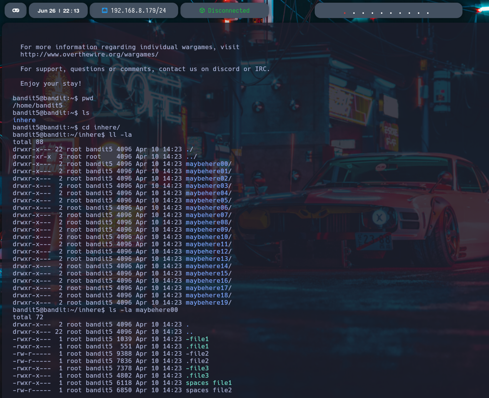
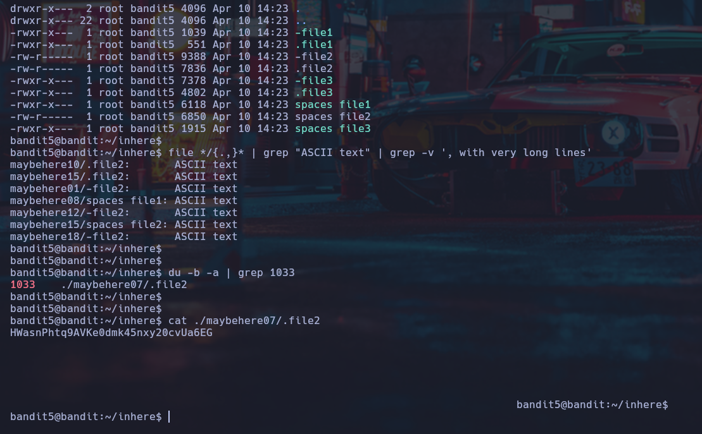

# Nivel 5 ➔ Nivel 6 - Bandit - OverTheWire

## 📖Introduccion

Este nivel nos propone encontrar la contraseña entre una gran cantidad de archivos ubicados dentro de varios subdirectorios.
La dificultad radica en saber cómo filtrar archivos según su tipo y tamaño para localizar el correcto.

## 🎯Objetivo

Encontrar la contraseña del usuario bandit6, que está almacenada en un archivo de tipo texto plano (ASCII text) de exactamente 1033 bytes.

## 📚Teoría

Para este tipo de desafíos, debemos combinar distintos comandos para inspeccionar archivos y sus propiedades:

file: analiza y muestra el tipo de contenido de un archivo.

du -b: muestra el tamaño en bytes de archivos y carpetas.

grep: nos permite filtrar resultados en función de un patrón.

cat: permite leer el contenido del archivo correcto.

Recordá también que podés utilizar comodines (*) y rutas relativas para recorrer múltiples carpetas rápidamente.

## ✅Solucion

1. Iniciar sesión por SSH con las credenciales del nivel 5:

```
ssh bandit5@bandit.labs.overthewire.org -p 2220
```

Usuario: ```bandit5```
Contraseña: (la obtenida del nivel anterior)

2. Ingresar al directorio inhere:

```
cd inhere
```


3. Buscar los archivos de tipo texto plano, excluyendo líneas con advertencias de texto largo:

```
file */* | grep "ASCII text" | grep -v ', with very long lines'
```

Esto filtra los archivos que contienen texto plano legible. Por ejemplo:

```
maybehere07/.file2: ASCII text
```

4. Buscar archivos de exactamente 1033 bytes:

```
du -b -a | grep 1033
```

Resultado esperado:
```
1033    ./maybehere07/.file2
```

5. Leer el contenido del archivo encontrado:

```
cat ./maybehere07/.file2
```

Salida:

```
HWsAnPhtq9AVKe0dmk45nxy2ocvUa6EG
```


Esa es la contraseña para el usuario bandit6!

## Mini tabla de comandos
| Comando | Descripción |
|----------|----------|
| ```file <archivo> ``` | Muestra el tipo de contenido del archivo |
| ```du -b -a ``` | Muestra el tamaño (en bytes) de todos los archivos |
| ```grep "<texto>"``` | Filtra líneas que coincidan con un patrón |
| ```cat <archivo>``` | Muestra el contenido del archivo |
| ```cd <directorio>``` | Cambia al directorio especificado |
| ```ssh``` | Conexión remota a través de SSH |
