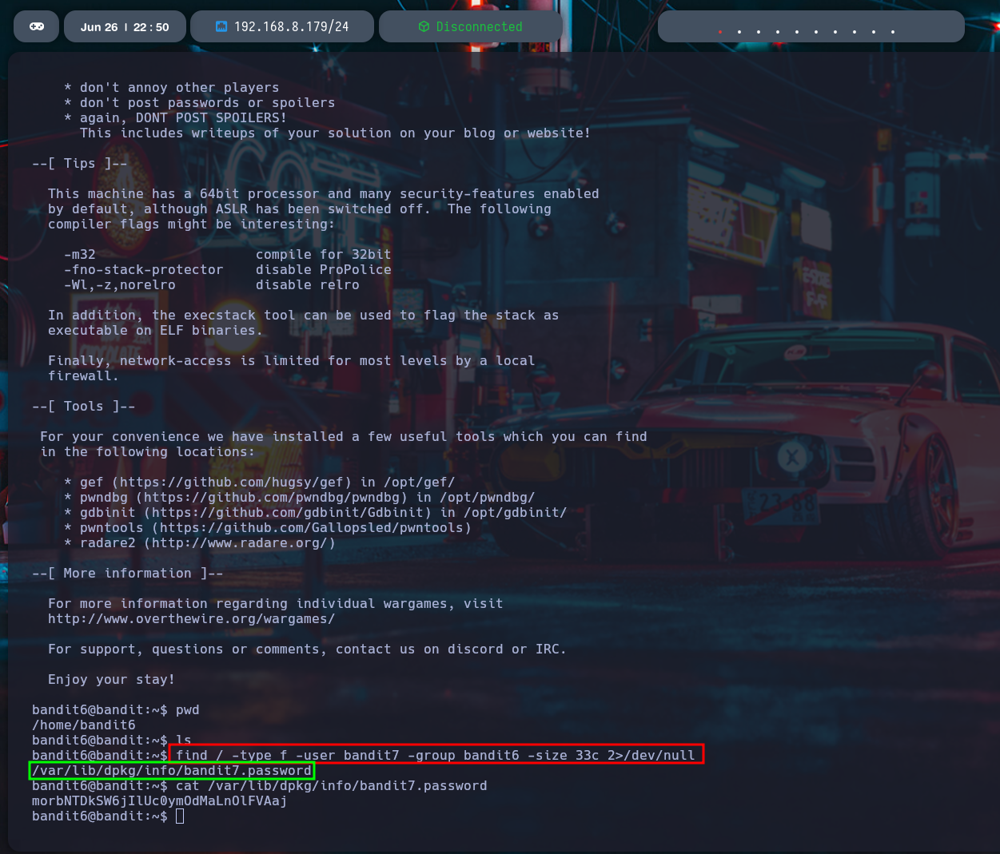

# Nivel 6 ➔ Nivel 7 - Bandit - OverTheWire

## 📖Introduccion

En este nivel comenzamos a explorar el sistema de archivos más allá del directorio home, utilizando herramientas más avanzadas para buscar archivos en todo el sistema.
El objetivo es encontrar un archivo específico según ciertos criterios de usuario, grupo y tamaño exacto.

## 🎯Objetivo

Encontrar la contraseña del usuario **bandit7**, ubicada en un archivo que:

Es propiedad del usuario **bandit6**

Pertenece al grupo **bandit6**

Tiene un tamaño exacto de **33 bytes**

## 📚Teoría

Para este tipo de búsquedas más complejas, se utiliza el comando **find**, que permite filtrar archivos en base a múltiples criterios, como:

-type f: busca solo archivos regulares (no directorios, enlaces, etc.).

-user <usuario>: busca archivos cuyo propietario sea el usuario especificado.

-group <grupo>: busca archivos que pertenezcan a cierto grupo.

-size 33c: busca archivos con exactamente 33 bytes (c indica “bytes”).

2>/dev/null: redirige los errores para que no se muestren (por ejemplo, permisos denegados).

Una vez localizado el archivo correcto, lo leemos con cat.

## ✅Solución

1. Conectarse al servidor con las credenciales del nivel 6:

```
ssh bandit6@bandit.labs.overthewire.org -p 2220
```
Usuario: ```bandit6```
Contraseña: (obtenida del nivel anterior)

2. Ejecutar el siguiente comando para buscar el archivo:

```
find / -type f -user bandit7 -group bandit6 -size 33c 2>/dev/null
```
Resultado esperado:

```
/var/lib/dpkg/info/bandit7.password
```

3. Leer el contenido del archivo encontrado:

```
cat /var/lib/dpkg/info/bandit7.password
```
Salida:

```
btTVzvy4ctAfDEl0GnLkDwav6C5ekciR
```

¡Y esa es la contraseña para el usuario bandit7!



## Mini tabla de comandos

| Comando | Descripción |
|----------|----------|
| ```find``` | Herramienta para buscar archivos y directorios
| ```find / -type f -user X -group Y -size 33c 2>/dev/null``` | Busca archivos con criterios de usuario, grupo y tamaño exacto
| ```cat <ruta>``` | Muestra el contenido del archivo especificado
| ```2>/dev/null``` | Oculta errores en la salida del comando
| ```ssh``` | Conexión remota a través de SSH
